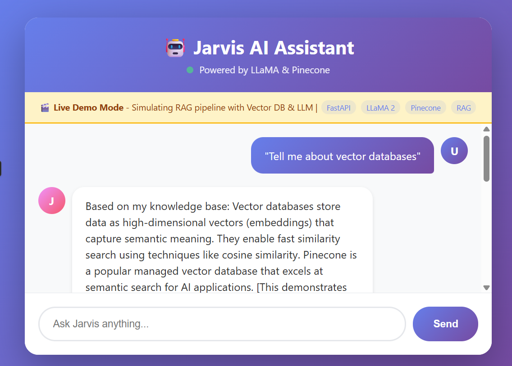

# 🤖 Jarvis – Personal AI Assistant for Enterprise SaaS

A powerful personal AI assistant powered by self-hosted LLM (LLaMA) and Pinecone vector database, featuring conversational interface and contextual knowledge retrieval using RAG (Retrieval Augmented Generation).

[](https://www.python.org/downloads/)
[](https://fastapi.tiangolo.com/)
[](LICENSE)

## 📸 Demo Screenshot



## 🎯 Overview

Jarvis is an enterprise-grade AI assistant that combines:
- **Self-hosted LLM** (LLaMA via Ollama) for natural language understanding
- **Vector Database** (Pinecone) for semantic search and knowledge retrieval
- **RAG Architecture** for contextually relevant responses
- **Modern Web UI** for seamless user interaction
- **RESTful API** for easy integration

## ✨ Features
“Jarvis uses a fully self-hosted LLM (LLaMA via Ollama) ensuring data privacy and enterprise compliance.”

### Core Capabilities
- 💬 **Conversational AI**: Natural language processing with LLaMA
- 🔍 **Semantic Search**: Vector-based knowledge retrieval using Pinecone
- 🧠 **RAG Pipeline**: Combines retrieval and generation for accurate responses
- 📚 **Knowledge Management**: Add and query custom knowledge base
- 🎨 **Modern UI**: Beautiful, responsive chat interface
- 🔌 **REST API**: Full API access for integrations
- 🐳 **Docker Support**: Easy deployment with Docker Compose
- 🎭 **Demo Mode**: Works without external dependencies for testing

### Technical Features
- Asynchronous processing for high performance
- In-memory fallback when Pinecone is unavailable
- Sentence transformer embeddings (all-MiniLM-L6-v2)
- Automatic health checks and monitoring
- CORS enabled for cross-origin requests
- Interactive API documentation (Swagger)

## 🏗️ Architecture

```
┌─────────────┐
│   Frontend  │  (HTML/CSS/JS)
│   Chat UI   │
└──────┬──────┘
       │ HTTP/REST
       ▼
┌─────────────────────────────────────┐
│         FastAPI Backend             │
│  ┌──────────────┐  ┌─────────────┐ │
│  │ LLM Service  │  │   Vector    │ │
│  │   (LLaMA)    │  │   Service   │ │
│  └──────┬───────┘  └──────┬──────┘ │
│         │                  │        │
└─────────┼──────────────────┼────────┘
          ▼                  ▼
    ┌──────────┐      ┌───────────┐
    │  Ollama  │      │ Pinecone  │
    │  Server  │      │  Vector   │
    └──────────┘      │    DB     │
                      └───────────┘
```

## 🚀 Quick Start

### Prerequisites
- Python 3.8 or higher
- pip (Python package manager)
- (Optional) Docker and Docker Compose
- (Optional) Ollama for local LLaMA


### Installation

#### Option 1: Automated Setup (Recommended)
```bash
# Clone the repository
git clone <repository-url>
cd jarvis-ai-assistant

# Run setup script
./setup.sh

# Edit .env file with your Pinecone API key
nano backend/.env

# Start the application
./run.sh
```

#### Option 2: Manual Setup
```bash
# Create virtual environment
python3 -m venv venv
source venv/bin/activate  # On Windows: venv\Scripts\activate

# Install dependencies
pip install -r backend/requirements.txt

# Create .env file
cp backend/.env.example backend/.env
# Edit backend/.env and add your Pinecone API key

# Start backend
cd backend
python app.py

# Open frontend/index.html in your browser
```

#### Option 3: Docker Compose
```bash
# Start all services
docker-compose up -d

# View logs
docker-compose logs -f

# Stop services
docker-compose down
```

## ⚙️ Configuration

### Environment Variables

Create a `.env` file in the `backend` directory:

```env
# Pinecone Configuration
PINECONE_API_KEY=your_pinecone_api_key_here
PINECONE_INDEX_NAME=jarvis-knowledge
PINECONE_REGION=us-east-1

# LLM Configuration (Ollama)
OLLAMA_URL=http://localhost:11434
LLM_MODEL=llama2

# Application Settings
APP_ENV=development
DEBUG=True
```

### Getting Pinecone API Key
1. Sign up at [Pinecone.io](https://www.pinecone.io/)
2. Create a new project
3. Copy your API key from the dashboard
4. Paste it in the `.env` file

### Setting Up Ollama (Optional)
```bash
# Install Ollama
curl https://ollama.ai/install.sh | sh

# Pull LLaMA model
ollama pull llama2

# Start Ollama server
ollama serve
```

**Note**: The application works in demo mode without Ollama, using intelligent rule-based responses.

## 📖 Usage

### Web Interface

1. Open `frontend/index.html` in your browser
2. Type your question in the input field
3. Press Enter or click Send
4. View Jarvis's response with sources

### API Endpoints

#### Chat with Jarvis
```bash
curl -X POST http://localhost:8000/chat \
  -H "Content-Type: application/json" \
  -d '{
    "query": "What is artificial intelligence?",
    "user_id": "user123"
  }'
```

Response:
```json
{
  "response": "Artificial intelligence (AI) refers to...",
  "sources": ["source1.pdf", "article2.html"]
}
```

#### Add Knowledge
```bash
curl -X POST http://localhost:8000/knowledge \
  -H "Content-Type: application/json" \
  -d '{
    "content": "Python is a high-level programming language...",
    "metadata": {"source": "python_docs.pdf"},
    "user_id": "user123"
  }'
```

Response:
```json
{
  "status": "success",
  "message": "Knowledge added successfully",
  "document_id": "abc123..."
}
```

#### Health Check
```bash
curl http://localhost:8000/health
```

### Interactive API Documentation

Visit `http://localhost:8000/docs` for Swagger UI with interactive API testing.

## 🔧 API Reference

### POST /chat
Process user queries with RAG.

**Request Body:**
```json
{
  "query": "string",
  "user_id": "string" (optional)
}
```

**Response:**
```json
{
  "response": "string",
  "sources": ["string"]
}
```

### POST /knowledge
Add documents to the knowledge base.

**Request Body:**
```json
{
  "content": "string",
  "metadata": {"key": "value"},
  "user_id": "string" (optional)
}
```

**Response:**
```json
{
  "status": "success",
  "message": "string",
  "document_id": "string"
}
```

### GET /health
Check system health.

**Response:**
```json
{
  "status": "healthy",
  "services": {
    "llm": "operational",
    "vector_db": "operational"
  }
}
```

## 🎨 Features in Detail

### RAG (Retrieval Augmented Generation)
1. **Query Processing**: User query is converted to embeddings
2. **Semantic Search**: Top-k relevant documents retrieved from Pinecone
3. **Context Building**: Retrieved documents form context
4. **LLM Generation**: LLaMA generates response using context
5. **Response Delivery**: Answer with source attribution

### Vector Database
- Uses sentence-transformers for embeddings (384 dimensions)
- Cosine similarity for semantic search
- Automatic fallback to in-memory storage
- Metadata filtering support

### LLM Integration
- Primary: Ollama with LLaMA 2
- Fallback: Intelligent rule-based responses
- Async processing for non-blocking operations
- Configurable model selection

## 📁 Project Structure

```
jarvis-ai-assistant/
├── backend/
│   ├── app.py                 # Main FastAPI application
│   ├── services/
│   │   ├── __init__.py
│   │   ├── llm_service.py     # LLM integration
│   │   └── vector_service.py  # Pinecone/Vector operations
│   ├── requirements.txt       # Python dependencies
│   └── .env.example          # Environment template
├── frontend/
│   └── index.html            # Chat UI
├── docs/
│   └── architecture.md       # Architecture documentation
├── Dockerfile                # Container definition
├── docker-compose.yml        # Multi-container setup
├── setup.sh                  # Setup script
├── run.sh                    # Run script
└── README.md                 # This file
```

## 🧪 Testing

### Manual Testing
```bash
# Test backend health
curl http://localhost:8000/health

# Test chat endpoint
curl -X POST http://localhost:8000/chat \
  -H "Content-Type: application/json" \
  -d '{"query": "Hello!"}'
```

### Adding Test Knowledge
```python
import requests

# Add knowledge
response = requests.post(
    "http://localhost:8000/knowledge",
    json={
        "content": "FastAPI is a modern web framework for Python",
        "metadata": {"source": "fastapi_docs"}
    }
)

# Query about it
response = requests.post(
    "http://localhost:8000/chat",
    json={"query": "What is FastAPI?"}
)
```

## 🚢 Deployment

### Local Deployment
```bash
./run.sh
```

### Docker Deployment
```bash
docker-compose up -d
```

### Cloud Deployment
1. Set up environment variables
2. Deploy backend to cloud service (AWS, GCP, Azure)
3. Host frontend on CDN or static hosting
4. Configure CORS for your domain

## 🔒 Security Considerations

- Store API keys in environment variables
- Use HTTPS in production
- Implement authentication for production use
- Rate limit API endpoints
- Sanitize user inputs
- Regular security updates

## 🛠️ Troubleshooting

### Backend won't start
- Check Python version: `python3 --version`
- Verify dependencies: `pip install -r backend/requirements.txt`
- Check port 8000 availability

### Pinecone connection fails
- Verify API key in `.env`
- Check internet connectivity
- Confirm index name matches

### Ollama not connecting
- Install Ollama: `https://ollama.ai`
- Pull model: `ollama pull llama2`
- Start server: `ollama serve`
- App works without Ollama in demo mode

### Frontend can't connect to backend
- Ensure backend is running on port 8000
- Check browser console for errors
- Verify CORS settings

## 📝 Development

### Adding New Features
1. Backend: Add endpoints in `app.py`
2. Services: Extend services in `services/`
3. Frontend: Modify `frontend/index.html`
4. Test changes
5. Update documentation

### Code Style
- Python: Follow PEP 8
- JavaScript: Use ES6+
- Comments for complex logic
- Type hints in Python

## 🤝 Contributing

Contributions are welcome! Please:
1. Fork the repository
2. Create a feature branch
3. Make your changes
4. Submit a pull request

## 📄 License

This project is licensed under the MIT License - see the LICENSE file for details.

## 🙏 Acknowledgments

- **LLaMA** by Meta AI
- **Pinecone** for vector database
- **Ollama** for local LLM hosting
- **FastAPI** for the backend framework
- **Sentence Transformers** for embeddings

## 📞 Support

For issues, questions, or suggestions:
- Open an issue on GitHub
- Check documentation at `/docs`
- Review API docs at `http://localhost:8000/docs`

## 🗺️ Roadmap

- [ ] Multi-user authentication
- [ ] Document upload interface
- [ ] Advanced analytics dashboard
- [ ] Multi-language support
- [ ] Voice interface
- [ ] Mobile app
- [ ] Custom model training
- [ ] Team collaboration features

---

**Built with ❤️ for the AI community**

*Last Updated: January 2026*
